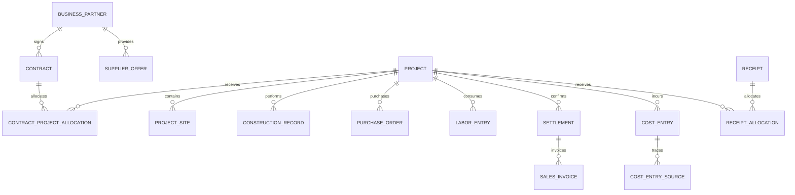

# 工程企业经营系统 V4 架构

版本：4.0  
日期：2026-07-30

## 1. 架构目标

V4 采用可渐进演进的模块化单体：当前保持 Python 桌面端和 SQLite 的部署便利，同时把业务规则从页面与 `database.py` 中抽离，使未来接入多用户服务端和 PostgreSQL 时不重写经营口径。

架构必须保证：

- 项目是独立核算边界。
- 履约、利润和现金是相互关联但不同的事实链。
- 所有经营数字可追溯到来源。
- 模糊数据允许未归集，不允许无依据强配。
- 迁移可演练、可备份、可校验。

## 2. 分层结构

```text
pages/                  桌面界面，只负责交互和展示
ui/                     设计系统、通用弹窗和布局
services/               用例、校验、事务和经营口径
repositories/           目标层：稳定的数据访问接口
db/
  connection.py         连接、外键和超时
  migration_runner.py   迁移、备份和版本记录
  migrations/           编号迁移
database.py             兼容层，逐模块收缩
scripts/                副本冒烟、完整性和回归校验
```

依赖方向只能从界面指向服务，再指向数据访问层。新页面不得直接新增 `database.py` 查询。

## 3. 业务模块边界

| 模块 | 负责的事实 | 不负责 |
|---|---|---|
| 组织与人员 | 组织、员工、用户、责任人 | 工人工资结算 |
| 客商主数据 | 客户、供应商、分包商、联系人 | 合同金额 |
| 项目 | 项目、地点、WBS、成员、状态 | 累计开票或回款 |
| 合同与结算 | 合同、版本、项目分配、结算 | 施工记录金额 |
| 采购 | 请购、询价、订单、到货、进项发票 | 最终项目利润 |
| 人工与分包 | 工时、工资快照、分包计量与结算 | 客户收入 |
| 施工履约 | 施工、工程量、验收、整改 | 自动确认收入 |
| 成本 | 成本事实、来源、分摊和过账 | 修改来源单据 |
| 应收与资金 | 销项发票、回款、付款、核销 | 倒推利润 |
| 经营分析 | 读模型、快照、指标和数据缺口 | 创建原始业务事实 |

## 4. 核心关系



年度合同通过 `contract_project_allocations` 分配给澄湖、蓝湾等项目。项目利润查询只读取本项目分配、结算和成本；合同汇总是上层聚合视图。

## 5. 事实模型

### 5.1 原始事实

- 合同签订、合同分配、结算确认。
- 采购订单、到货验收、供应商发票、付款。
- 工天、工资结算、分包计量与结算。
- 施工记录、验收、整改。
- 销项发票、回款和核销。
- 费用、成本过账和分摊。

原始事实不得被驾驶舱直接修改。经营看板只通过服务读取。

### 5.2 派生指标

- 合同额、结算收入、成本、毛利。
- 应收、已开票、已回款。
- 现金流入、现金流出、经营现金余额。
- 项目经营可核算率和各类归集率。

派生指标不存回项目表。若未来为性能建立月度快照，快照必须保存截止日、口径版本、生成时间，并可从事实重算。

### 5.3 当前过渡表

`project_operating_entries` 曾承载手工合同分配、结算、开票、回款、其他成本和其他付款。迁移 `160` 至 `180` 已将有效旧记录迁入正式事实并作废旧入口，原记录继续保留追溯。

正式迁移对应关系：

- `contract_value` → 合同与项目分配。
- `settlement` → 结算单。
- `invoice` → 销项发票。
- `receipt` → 回款及核销。
- `other_cost` → 成本台账。
- `other_payment` → 付款事实。

迁移保留来源编号和旧记录 ID，进行总额与项目级对账；项目经营核算页面中的旧手工事项现为只读。

注：付款事实（`payment_entries` / `payment_purchase_allocations`）功能已移除，两张表保留为空表；付款以采购单 `payment_status` / `payment_method` 文字标记为准。

## 6. 经营读模型

`services/operations_service.py` 是 V4.1 的组合读服务：

1. 从项目利润服务读取每个项目的结算、成本、毛利、应收和现金。
2. 从经营事项读取合同、结算、发票和回款存在性。
3. 计算在营项目、代理可核算项目、采购/人工归集率。
4. 输出每个项目的阶段和数据缺口。

页面只消费返回的视图模型，不知道表结构。未来严格口径上线时，只替换服务判定，不重写页面。

## 7. 金额、税和成本边界

- 财务金额统一为整数最小货币单位，字段后缀 `_minor` 或历史兼容 `_cents`。
- 税率使用基点或受控定点数，禁止二进制浮点承担正式金额。
- 采购单保存未税价、税率、税额、含税材料额和运费快照。
- 当前项目采购成本为含税材料额加运费。
- 供应商默认税率只影响新单预填，不回写历史。
- 工天旧表仍为 `REAL` 的金额必须在服务边界转换为整数分，V4.4 迁移后停止使用。

## 8. 状态与审计

- 主数据：启用、停用。
- 交易：草稿、已确认、已作废；需要冲销时生成关联调整事实。
- 所有正式单据包含 `organization_id`、`public_id`、状态、业务日期、创建/更新时间和经办人。
- 已确认单据不物理删除。
- 跨单据累计值由查询或快照计算，不在项目/合同单头维护不可验证的手工累计。

## 9. 事务与并发

当前 SQLite：

- 每个服务调用独立连接。
- 每个连接启用 `PRAGMA foreign_keys=ON` 和 `busy_timeout`。
- 单头、明细、来源关系和状态变化在同一显式事务中完成。
- 写入保持短事务，不跨界面等待用户操作。

未来服务端：

- repository 接口保持不变，底层替换 PostgreSQL。
- 使用连接池、数据库约束和事务隔离。
- 金额、业务编号和幂等键在服务端统一验证。

## 10. 迁移策略

1. 正式数据库迁移前自动创建带时间戳备份。
2. 在临时副本执行全部迁移和冒烟测试。
3. 校验迁移版本、表记录数、金额合计、项目级抽样、外键和孤立记录。
4. 正式库只执行已经在副本通过的同一迁移集合。
5. 失败时保留原库和备份，不在失败库上继续人工修补。
6. 模糊映射进入待归集队列，不阻塞确定数据迁移，也不自动猜测。

## 11. 逐步拆分 `database.py`

优先顺序：

1. V4.1：新增经营组合服务，首页停止直连旧查询。
2. V4.2：合同与结算使用独立 service/repository。
3. V4.3：开票、回款和核销使用独立 service/repository。
4. V4.4：人工与施工迁出 `database.py`。
5. V4.5：统一成本和付款，采购只暴露稳定服务接口。
6. 最后保留薄兼容适配器，在调用方清零后删除旧实现。

禁止一次性重写全部表或长期双写。每个模块按“迁移数据 → 对账 → 切换读取 → 切换写入 → 关闭旧入口”完成。

## 12. 架构验收门槛

## 13. V4.7 数据治理扩展

- `services/data_governance_service.py` 是经营口径缺口的只读汇总与安全确认边界，模糊历史归属保持待处理。
- 付款事实功能已移除：`payment_entries` / `payment_purchase_allocations` 保留为空表，采购付款状态以采购单上的文字标记为准。
- `business_attachments.construction_record_id` 将施工照片纳入统一附件账，保留 `construction_photos` 作为施工页面兼容入口。
- 迁移 300/310/320 分别负责采购付款、日期与索引、施工附件，并通过事务、备份和外键检查执行。

- 新经营页面不直接导入 `database.py`。
- 澄湖、蓝湾等项目级汇总互不影响。
- 施工、验收、结算、发票和回款金额来源独立。
- 归属不明的成本不会进入任一项目利润。
- 所有新金额字段使用整数分。
- 新迁移有副本冒烟、正式库备份和外键校验。
- 服务测试覆盖零分母、作废事实、项目隔离和金额恢复。
- 1200×800 下经营驾驶舱与编辑弹窗可完整操作。
