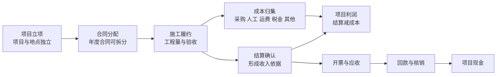

# 工程企业经营系统 V4 产品需求文档

版本：4.0  
日期：2026-07-30  
产品阶段：从业务记录工具升级为项目经营操作系统

## 1. 产品判断

这套软件的核心价值不是“把供应商、采购和工天录进电脑”，而是持续回答：

> 每一个独立项目到底赚没赚钱、钱有没有回来、这个结论是否可信。

项目是最小经营核算单元。客户、年度合同、供应商和人员可以跨项目复用，但不能因此合并项目利润。澄湖、蓝湾等地点分别立项、分别归集、分别核算；未来可以在同一年度合同下汇总查看，但汇总不改写各项目事实。

V4 不替代法定财务软件。它负责把合同、履约、采购、人工、成本、结算、开票和回款连接成可追溯的经营事实，为老板、项目负责人和业务人员提供同一口径。

## 2. 北极星指标

### 2.1 指标名称

**项目经营可核算率**

```text
已形成可追溯结算口径的在营项目数 ÷ 全部在营项目数
```

按指定截止日计算。一个项目进入严格“可核算”状态应同时满足：

1. 项目边界明确，状态为筹备中或进行中。
2. 客户合同或年度合同分配到该项目的收入边界可追溯。
3. 至少存在一笔有效结算确认。
4. 截止日以前的材料、人工、运费、税金和其他成本已归集，或未归集事项已明确挂账并由责任人确认。
5. 收入与成本事实均能追溯到原始单据，且不存在阻断核算的数据异常。

发票和回款影响应收及现金完整度，但不用于把施工产值认定为收入。

### 2.2 当前正式口径

合同、项目分配和结算事实已经落地。当前使用：

```text
同时存在有效合同项目分配和有效结算确认的在营项目数
÷ 全部在营项目数
```

采购与人工归集率、待验收和数据完整性作为独立护栏展示，不为提高北极星指标强行归集模糊数据。

### 2.3 驱动指标

- 合同分配覆盖率：已有有效合同分配的在营项目数 / 在营项目数。
- 结算覆盖率：已有结算确认的在营项目数 / 在营项目数。
- 采购归集率：已归集项目采购成本 / 全部有效采购成本。
- 人工归集率：唯一归集到项目的人工成本 / 全部人工成本。
- 开票覆盖率：已有结算项目中存在销项发票记录的项目数 / 已结算项目数。
- 回款覆盖率：已有结算项目中存在回款记录的项目数 / 已结算项目数。

### 2.4 护栏指标

- 未归集采购笔数与金额。
- 未归集人工条数与金额。
- 待验收、需整改记录数。
- 回款或开票超过结算金额的异常数。
- 外键异常、孤立记录和重复单号数。
- 被强制匹配或无法追溯来源的记录数，目标为 0。

不把页面访问量、录入笔数、采购金额或施工金额作为北极星指标，它们可能鼓励多录数据，却不能证明经营结论更可靠。

## 3. 目标用户与职责

### 3.1 经营者

查看项目组合、确认利润和现金风险、决定催款或补资料的优先级。

### 3.2 项目负责人

建立项目和地点，维护合同分配、施工履约、结算状态，处理项目数据缺口。

### 3.3 采购人员

维护材料与供应商报价，登记含税材料成本、税金和运费，将采购归集到项目。

### 3.4 现场与人工记录人员

记录施工起止日期、作业位置、自由格式安装明细、工程金额、验收和工天。

### 3.5 财务/内勤

登记结算、发票、回款、付款和核销，检查金额边界及单据附件。

单机版暂不实现完整权限，但数据模型和服务接口必须保留组织、经办人、状态和审计字段。

## 4. 产品信息架构

### 4.1 经营决策

- 经营驾驶舱
- 项目经营核算

### 4.2 项目履约

- 项目台账
- 施工与验收
- 采购管理
- 人工与工天

### 4.3 供应链资料

- 客商与供应商
- 材料与报价
- 报价对比

### 4.4 数据工具

- AI 经营助手
- 数据导入导出

未来的项目工作空间将成为跨模块入口：进入一个项目后，可直接查看概况、合同、施工、采购、人工、成本、结算、发票、回款和资料完整度。

## 5. 核心经营闭环



三个事实链必须独立：

- 履约链：施工记录、工程量、验收、整改。
- 利润链：合同分配、结算确认、成本归集、毛利。
- 现金链：开票、回款、采购付款、其他付款、现金余额。

## 6. 核心业务规则

### 6.1 项目边界

- 每笔项目业务只能归属一个项目；跨项目费用通过分摊单拆分。
- 同一客户或合同下的项目不自动合并。
- 项目可有多个地点，地点只在项目内唯一。
- 模糊历史人工或地点保持“未归集”，不为提高指标强行匹配。

### 6.2 收入

- 施工记录金额和验收金额不是收入。
- 已结算收入来自有效结算确认。
- 合同额是收入边界，不是已实现收入。
- 作废、红冲和调整必须保留历史链路。

### 6.3 成本

- 当前采购成本按含税材料金额加运费归集。
- 供应商默认税率只预填新业务；采购保存成交时的未税价、税率、税额、含税价和运费快照。
- 人工只有在项目唯一匹配时进入项目成本。
- 已从采购、人工等来源自动归集的成本不得重复登记为其他成本。
- 未来统一成本台账以到货、领用、工资结算、分包结算或费用过账为成本事实，不永久把采购订单等同于成本。

### 6.4 利润与现金

```text
确认口径毛利 = 已结算收入 - 已归集项目成本
应收未收 = 已结算收入 - 已回款
经营现金余额 = 已回款 - 已记录经营现金支出
```

毛利和现金余额始终分开显示。

## 7. 功能需求

### 7.1 经营驾驶舱

- 显示项目经营可核算率、已确认项目毛利、应收未收和未归集成本。
- 展示全部项目的当前阶段、结算、成本、毛利、现金和数据缺口。
- 未结算项目的毛利显示“待结算”，不展示伪精确结论。
- 展示采购、人工、结算覆盖率和待验收数量。
- 双击项目进入项目经营核算。
- 数据为 0 时正常展示，不用采购金额或施工金额替代经营结果。

### 7.2 项目台账

- 建立项目编码、名称、客户、负责人、状态、起止日期和备注。
- 在项目下维护多个独立地点。
- 项目编辑弹窗可缩放、可滚动、底部操作固定。
- 项目停用不得删除历史业务。

### 7.3 合同与结算

- 支持客户年度合同、单项目合同和补充协议。
- 年度合同可按金额或清单分配给多个项目，分配总额不得超过可分配合同额。
- 合同分配不合并项目核算。
- 支持阶段结算、最终结算、作废和调整。
- 结算必须关联项目、合同、期间、金额、依据和附件。

### 7.4 采购与材料

- 供应商维护默认税率，采购时允许覆盖。
- 同时展示未税材料价、税率、税额、含税材料价和运费。
- 运费可自由填写，纳入项目采购成本。
- 采购可暂不归集，但必须进入待归集队列。
- 历史单据保存成交快照，不受材料或供应商档案修改影响。

### 7.5 人工

- 工天记录最终必须直接关联项目、地点、工人和工资快照。
- 当前自由文本历史工地只做兼容读取。
- 模糊匹配不得自动写回项目。
- 编辑弹窗遵守统一滚动和固定操作区规范。

### 7.6 施工与验收

- 先选择项目，再选择项目地点。
- 记录开始日期、结束日期、具体作业位置。
- 安装明细使用大文本框，允许自由记录多种材料、规格、长度和数量。
- 单独记录该作业位置的工程金额。
- 支持多张施工照片、验收照片、待验收、已验收、需整改和复验。
- 工程金额不自动生成结算或收入。

### 7.7 开票、回款与核销

- 销项发票与回款分别登记。
- 一笔回款可核销多个项目或发票，但核销明细必须落到项目。
- 展示结算未开票、已开票未回款、逾期应收。
- 回款超过结算或发票超过结算时提示异常，不静默接受。

### 7.8 项目经营核算

- 收入阶梯分别展示合同分配、现场记录、验收、结算、开票和回款。
- 成本拆分展示未税材料、税额、运费、人工、其他成本。
- 同时展示确认毛利、毛利率、应收和经营现金余额。
- 明确提示未归集采购和人工。
- 支持查看每个指标的来源明细。

## 8. 非功能要求

- 所有财务金额使用整数分，日期和时间遵守统一格式。
- 所有连接启用外键，关键写操作使用事务。
- 正式数据库迁移前自动备份，并先在副本上演练。
- 已确认业务不物理删除。
- 页面在 1200×800 下可用；编辑弹窗无需先放大主窗口。
- 关键操作支持键盘焦点和 Escape。
- 单机 SQLite 阶段保证可恢复；未来迁移 PostgreSQL 时不改变业务口径。
- API Key 不写入日志、测试输出、PRD 或数据库业务表。

## 9. V4.1 验收标准

1. 首页名称为“经营驾驶舱”，导航按经营决策、项目履约、供应链资料和数据工具分组。
2. 首页四项核心指标来自统一服务，不直接在页面拼接旧数据库查询。
3. 全部项目独立成行，并展示数据缺口。
4. 当前没有结算事实时，可核算率明确显示 0%，确认毛利不伪造。
5. 采购和人工未归集金额可见。
6. 澄湖、蓝湾等项目不会被合同、客户或地点文本合并。
7. 新经营服务、利润中心、采购税费运费、项目、施工、V3 兼容和弹窗布局测试通过。
8. 正式数据库外键、主数据映射和地点完整性校验均为 0 异常。

## 10. 已交付范围

### V4.7 数据治理与采购付款事实（已完成）

- 新增“数据治理中心”，集中展示并处理待归集人工、待归集采购、项目客户/地点/合同/结算缺口、待验收、关键附件和历史付款状态缺口。
- 人工和采购归集只接受用户明确选择的项目；保存待归集记录时二次提示，不根据模糊文本自动猜测。
- 项目客户确认可选择已有客商或建立新客户，并可同步补齐已分配合同中的空客户关系。
- 付款事实功能已移除：付款以采购单支付状态/支付方式文字标记为准，系统不再维护付款台账与采购核销。
- 施工/验收照片同步进入统一附件账，旧照片路径和施工页面操作保持不变。
- 关键外键列均建立前导索引，历史非零填充施工日期安全规范为 ISO 日期。
- 采购、报价对比和导入导出页面不再直接依赖 `database.py`。

### V4.1 经营可见性（已完成）

经营驾驶舱、项目阶段、数据缺口、北极星指标和 V4 文档。本阶段不修改正式业务事实。

### V4.2 合同与结算事实（已完成）

建立合同、项目分配、合同版本、阶段结算和来源附件，替代手工合同/结算经营事项。

### V4.3 开票、回款与核销（已完成）

建立销项发票、回款、应收和跨项目核销，升级现金完整度指标。

### V4.4 人工与施工服务化（已完成）

将人工、施工验收迁入正式服务层；工天直接关联项目和地点；统一附件。

### V4.5 统一成本与付款事实（已完成）

建立成本台账、工资/分包/费用过账与成本分摊，停止把采购订单永久视为最终成本。（原付款事实功能已移除，付款以采购单文字标记为准。）

### V4.6 项目工作空间（已完成）

以项目为入口串联合同、履约、成本、结算和现金，增加期间快照、责任人和待办。

## 11. 本期不做

- 法定总账、凭证、税务申报。
- 多组织复杂权限和云端协同。
- 在没有可靠来源前预测项目最终利润。
- 用 AI 自动修复归属不明的历史数据。
- 为了提升可核算率而自动生成合同、结算、发票或回款事实。
